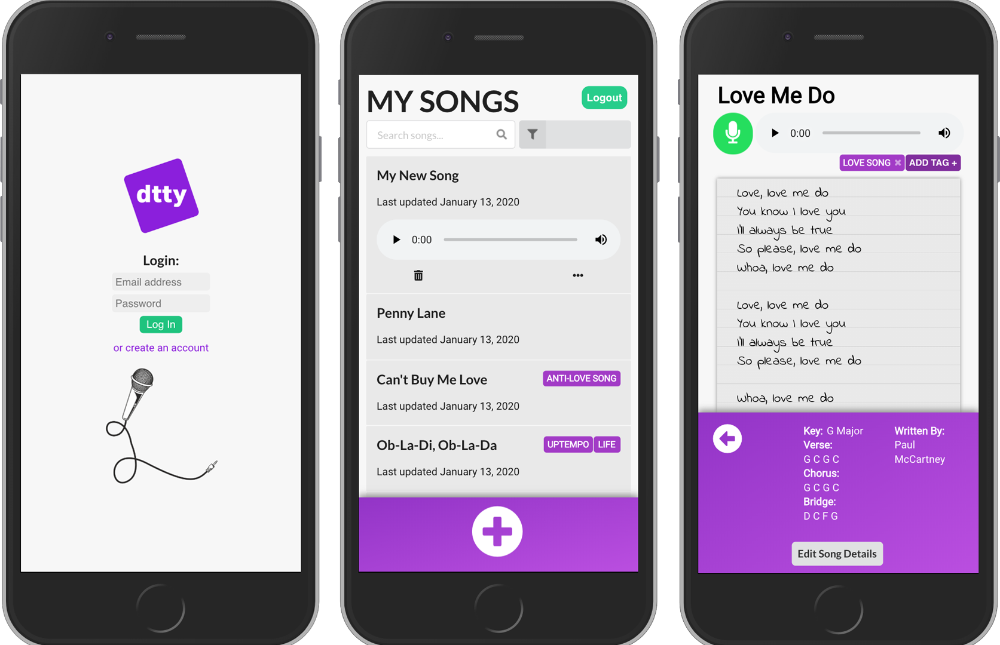

# dtty
## A songwriting app you can use whenever, wherever

**dtty** is a dynamic, mobile-friendly web application built
using React. It is a songwriting app where users can
capture audio and text as well as add keys, chords, writer
names, and tags to each song. The idea was born from a
problem I identified when I was still working as an audio engineer. I
realized that when someone had a song idea, there was
no widely-used mobile application that would allow that person to
store lyrics (text) and melodies (audio) in a single, organized place.
**dtty** was created to solve this problem.

___________________________________

## Technologies Used

    - ReactJS
    - MediaStream Recording API
    - Firebase Cloud Storage
    - JSON Server
    - MomentJS
    - Semantic UI
    - Fort Awesome

_____________________________________

## How It Works
**dtty** allows each user to create an account and login to show their unique song collection. From here, they can create a new song or view/edit an existing song from their collection.

Also from the song collection view, a user can search for a word or term in the title and lyrics of each song to filter down the results.

When a user creates a new song, they can not only write lyrics, but also record audio by clicking the Microphone icon.

A user can add the song's key and chords.

A user can add additional writers to each song.

___________________________________

## Setup
### Follow these instructions to setup this application on your computer
1. Click the green **Clone or download** button on the top right of this repo and copy the SSH key from here
1. Clone this repository using `git clone [paste_SSH_key_here]`
1. `cd` into the directory it creates
1. Run `npm install` inside your terminal and wait for all dependencies to be installed
1. Run `npm start` inside your terminal to verify that installation was successful
1. Open another terminal window and navigate to the **api** folder within the **src** folder
1. Run `json-server -p 5002 -w dtty.json` using your terminal
1. Lastly, you will need to create your own Firebase Cloud Storage account and setup your config file for this
1. Go to [Google's Firebase Site](https://console.cloud.google.com/freetrial) to setup a free acount
1. Grab the config information and then create a **config** folder within the **src** folder
1. In this new **config** folder, create a file called **FirebaseConfig.js**
1. Paste your config information here (the whole config folder will be `.gitignore`-ed)
1. The app should now be fully-functioning

_____________________________________
&copy; 2020   | Application written by Sam Pita
